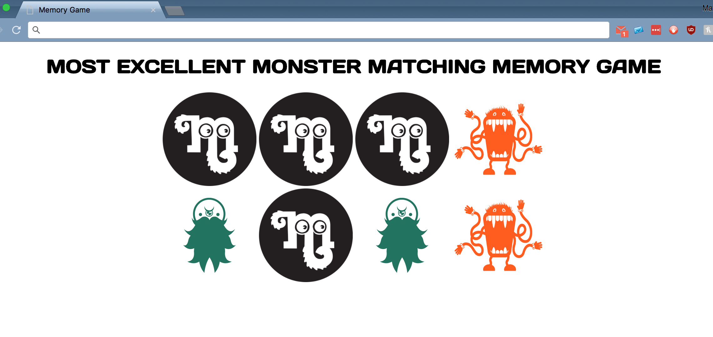
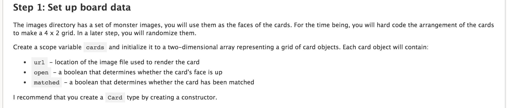
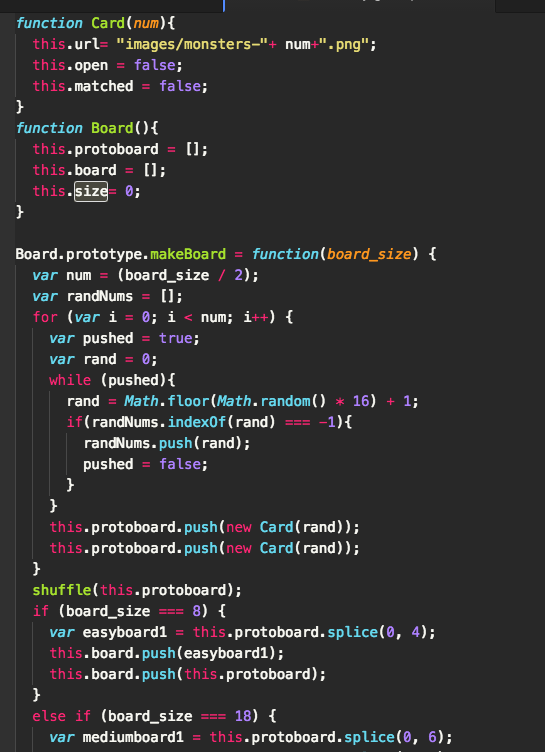

# Simple Memory Game

### Game Overview

This project is a simple memory game. For those that have never played or can't remember, the game is played using an even number of cards of matched pairs. The cards are placed face down and the player chooses two cards at a time, searching for the matched pairs. If the two cards that a player chooses match, the cards stay face up. If the cards do not match, then the cards are turned back over and the player chooses two more cards. The game ends when the player finds all of the matched pairs.

### Skills and Languages

Simple Memory was a project assignment for the course I am taking at [DigitalCrafts](www.digitalcrafts.com). For the project I was also paired with one of the other students in the class and we did pair programming, with each of us taking 30 minute turns at the keyboard. The project was a way for us to practice using AngularJS and Javascript (along with HTML and CSS). Most of the code is contained with the memory_game.js file, with about half being Angular and the other half Javascript.

One of the reasons we used Angular, aside from it being in the directions of the assignment, was to practice creating a dynamically created single page app. That is, when a game is reset using the refresh button on the browser or when a player chooses to play another game after winning the board, the entire game is created anew within the browser.

### Methodologies Overview

As I've said before, this project was an assignment, so this wasn't something my partner and I just build from scratch using our own wits and knowledge. There were basic directions and a roadmap. For example:

General directions to point us in the right direction, but how you get to the end was up to us. So, we ended up removing the Card and Board constructors outside of the $scope:

Our Card constructor would create a single Card, giving it a url (to get the image file) and an open and a matched property, both of which are set to false. We then had a Board constructor that would use the Card constructor to populate the board with a random selection of cards depending on the board size.

### Challenges

The challenge, initially, was getting used to working with Angular in that this was the first project where we had to use it after a day of introduction and basic exercises with the framework. So, really, it just took practice writing the code and looking back over the previous day's work to make sure we were doing things correctly.

This is the simplest of Angular implementations in that there are no use of states or stateParams or routing. It's just a single page and a single JS file and controller controlling that page. Still, though, since we'd only just been introduced to Angular, it was tough remembering when and where we were to use $scope variables. Once we got our heads around that it got a bit easier to start working on the logic of the game.

And once we were into the logic then my old nemesis, the nested if statement and for loop, reared it's ugly head. As a new programmer this seems to be the most difficult thing to keep straight in my head.
